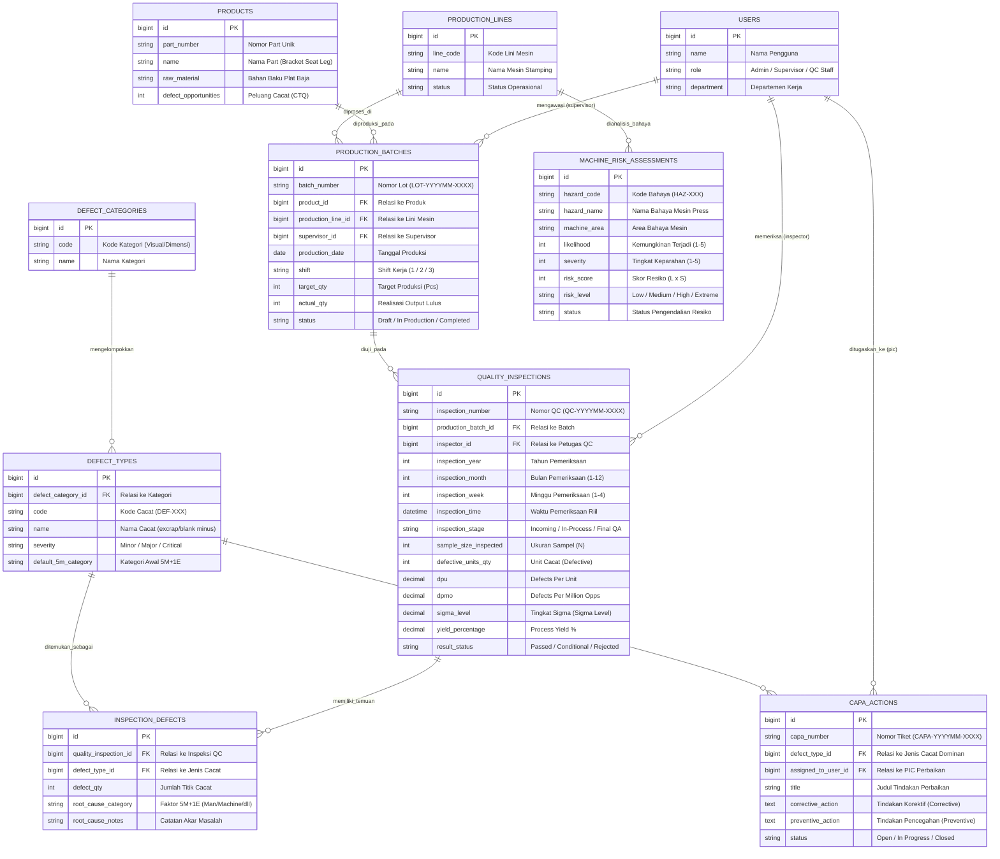

# ENTITY-RELATIONSHIP DIAGRAM (ERD)
## Sistem Pemantauan Produksi & Pengendalian Cacat Produk (Six Sigma DMAIC)
### Kasus Manufaktur: Bracket Seat Leg Mobil & Analisa Resiko Mesin Stamping Press

Dokumen ini memuat diagram **Entity-Relationship Diagram (ERD)** yang disederhanakan (*simple and business-focused*), khusus mencakup entitas proses bisnis manufaktur, pengujian mutu Six Sigma, tindakan perbaikan (CAPA), dan keselamatan kerja (K3) mesin press.

> [!NOTE]
> **Pengecualian Tabel Internal Framework**:
> Sesuai standar pemodelan basis data proses bisnis, tabel-tabel bawaan framework Laravel (seperti `migrations`, `cache`, `cache_locks`, `jobs`, `job_batches`, `failed_jobs`, `sessions`, dan `password_reset_tokens`) **tidak diikutsertakan** dalam diagram ini agar model konseptual dan logis tetap ringkas dan terfokus pada fungsionalitas aplikasi.

---

## 1. Visualisasi Diagram ERD (Mermaid)

---

## 2. Kamus Relasi Antar Tabel (Relationship & Cardinality)

| No | Entitas Asal | Relasi | Entitas Tujuan | Foreign Key | Keterangan Logika Bisnis |
|:--:|---|:---:|---|---|---|
| **1** | `PRODUCTS` | **1 : N** | `PRODUCTION_BATCHES` | `product_id` | Satu part produk diproduksi dalam banyak lot/batch produksi. |
| **2** | `PRODUCTION_LINES` | **1 : N** | `PRODUCTION_BATCHES` | `production_line_id` | Satu lini/mesin stamping menjalankan banyak perintah batch. |
| **3** | `USERS` | **1 : N** | `PRODUCTION_BATCHES` | `supervisor_id` | Satu supervisor mengawasi dan menjadwalkan banyak batch produksi. |
| **4** | `PRODUCTION_BATCHES` | **1 : N** | `QUALITY_INSPECTIONS` | `production_batch_id` | Satu lot produksi dapat diuji berkala (tahap In-Process hingga Final QA). |
| **5** | `USERS` | **1 : N** | `QUALITY_INSPECTIONS` | `inspector_id` | Satu staf QC inspector melakukan banyak sesi pengujian mutu. |
| **6** | `QUALITY_INSPECTIONS` | **1 : N** | `INSPECTION_DEFECTS` | `quality_inspection_id` | Satu pengujian QC dapat menemukan beberapa item rincian titik cacat fisik. |
| **7** | `DEFECT_CATEGORIES` | **1 : N** | `DEFECT_TYPES` | `defect_category_id` | Satu kategori cacat (misal: Dimensi) membawahi banyak jenis cacat spesifik. |
| **8** | `DEFECT_TYPES` | **1 : N** | `INSPECTION_DEFECTS` | `defect_type_id` | Suatu jenis cacat tertentu dapat ditemukan di berbagai transaksi inspeksi. |
| **9** | `DEFECT_TYPES` | **1 : N** | `CAPA_ACTIONS` | `defect_type_id` | Jenis cacat dominan (hasil analisis Pareto) memicu tindakan perbaikan CAPA. |
| **10**| `USERS` | **1 : N** | `CAPA_ACTIONS` | `assigned_to_user_id` | Satu user/engineer ditugaskan sebagai PIC penyelesaian tiket CAPA. |
| **11**| `PRODUCTION_LINES` | **1 : N** | `MACHINE_RISK_ASSESSMENTS` | *Konteks Area Lini* | Mesin stamping press pada lini produksi dianalisis potensi bahaya K3-nya. |

---

## 3. Ringkasan Modul & Peran Fungsional

1. **Modul Master Data Manufaktur**:
   - `products`: Menyimpan spesifikasi teknis part otomotif (Bracket Seat Leg), bahan plat baja SPCC/SPHC, dan nilai $O$ (*Defect Opportunities per Unit*).
   - `production_lines`: Mengelola inventaris lini mesin stamping press 250 Ton.
   - `defect_categories` & `defect_types`: Mengelola taksonomi cacat dan 5 CTQ kritis (*excrap, blank minus, trim minus, deformasi, karat*).

2. **Modul Operasional & Six Sigma DMAIC**:
   - `production_batches` (*Define & Measure*): Mencatat lot kerja dan target output.
   - `quality_inspections` (*Measure*): Menyimpan sampling mutu dengan dropdown bulan & minggu keberapa (1-4), menghitung otomatis $DPU$, $DPMO$, $Yield$, dan $Sigma\ Level$.
   - `inspection_defects` (*Analyze*): Merekam temuan cacat fisik dan pengelompokan faktor diagram tulang ikan (Fishbone 5M+1E Ishikawa).
   - `capa_actions` (*Improve & Control*): Mengelola tiket tindakan pencegahan dan perbaikan berkala.

3. **Modul Keselamatan & Kesehatan Kerja (K3)**:
   - `machine_risk_assessments`: Mengidentifikasi titik jepit, bahaya scrap, dan pengendalian bahaya mesin press dengan formula matriks $Risk = Likelihood \times Severity$.
