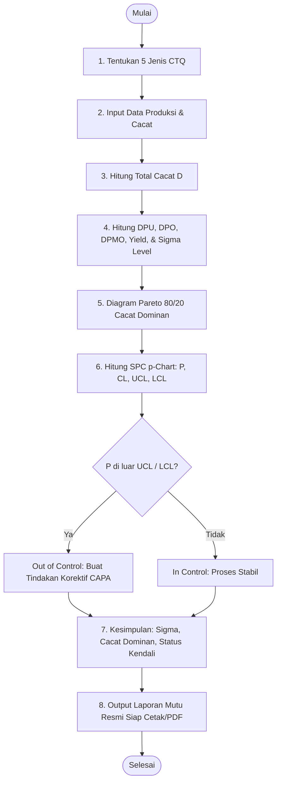

# PANDUAN PENGGUNAAN SISTEM (USER MANUAL)
## Sistem Pemantauan Produksi & Six Sigma DMAIC Manufaktur Bracket Seat Leg Mobil
### Dilengkapi Modul Analisa Resiko Kerja (K3) Mesin Stamping Press

---

## 📌 Daftar Isi
1. [Akses Sistem, Hak Akses (RBAC), & Akun Pengguna](#1-akses-sistem-hak-akses-rbac--akun-pengguna)
2. [Alur Operasional Sistem (Flowchart DMAIC)](#2-alur-operasional-sistem-flowchart-dmaic)
3. [Panduan Master Data (Produk, Mesin, & 5 CTQ)](#3-panduan-master-data-produk-mesin--5-ctq)
4. [Panduan Manajemen Batch Produksi](#4-panduan-manajemen-batch-produksi)
5. [Panduan Inspeksi Kualitas (QC) & Kalkulator Six Sigma Real-Time](#5-panduan-inspeksi-kualitas-qc--kalkulator-six-sigma-real-time)
6. [Panduan Analitik Mutu DMAIC (Pareto, p-Chart, & Fishbone)](#6-panduan-analitik-mutu-dmaic-pareto-p-chart--fishbone)
7. [Panduan Kesimpulan Mutu & Cetak Laporan Resmi](#7-panduan-kesimpulan-mutu--cetak-laporan-resmi)
8. [Panduan Tindakan Korektif (CAPA)](#8-panduan-tindakan-korektif-capa)
9. [Panduan Modul Analisa Resiko Kerja Mesin Stamping Press (K3)](#9-panduan-modul-analisa-resiko-kerja-mesin-stamping-press-k3)
10. [Panduan Manajemen Pengguna & Otorisasi (Khusus Super Admin)](#10-panduan-manajemen-pengguna--otorisasi-khusus-super-admin)
11. [Pertanyaan Umum & Troubleshooting (FAQ)](#11-pertanyaan-umum--troubleshooting-faq)

---

## 1. Akses Sistem, Hak Akses (RBAC), & Akun Pengguna

### Alamat URL Aplikasi
Buka browser (Google Chrome, Microsoft Edge, Mozilla Firefox) dan akses:
```
http://localhost:8000
```
atau melalui virtual host Laragon yang telah diset:
```
http://newwebapps.test
```

### Akun Login Bawaan (Default Credentials)
Sistem menyediakan 3 level akun sesuai peran struktural di pabrik manufaktur:

| Peran (Role) | Email | Password | Jabatan Pabrik | Deskripsi Wewenang |
|---|---|---|---|---|
| **Super Admin** (`admin`) | `admin@company.com` | `password` | Plant Manager / Administrator | Memiliki wewenang tertinggi: Akses penuh analitik Six Sigma, master data (tambah/edit/hapus), manajemen pengguna pabrik, dan penghapusan data permanen. |
| **QC Inspector** (`staff`) | `staff@company.com` | `password` | Lead QC Inspector / Tim Mutu | Bertanggung jawab atas pengujian sampling mutu: Menginput inspeksi batch, mencatat 5 CTQ, simulasi Six Sigma real-time, cetak sertifikat QC, dan membuat tiket CAPA. |
| **Supervisor** (`employee`) | `employee@company.com` | `password` | Production Supervisor / Line Head | Bertanggung jawab atas operasional lantai pabrik: Membuat jadwal & lot batch produksi, mengelola analisa bahaya & resiko mesin press (K3), serta menindaklanjuti program CAPA. |

### Matriks Hak Akses & Batasan Menu (Role-Based Access Control)

| Modul / Tindakan | Super Admin (`admin`) | QC Inspector (`staff`) | Supervisor (`employee`) | Keterangan Proteksi |
|---|:---:|:---:|:---:|---|
| **Dashboard Eksekutif Six Sigma** | ✅ Penuh | ✅ Lihat | ✅ Lihat | Seluruh pengguna dapat memantau KPI mutu pabrik |
| **Analitik DMAIC (Pareto, p-Chart, Fishbone)** | ✅ Penuh | ✅ Lihat & Cetak | ✅ Lihat & Cetak | Seluruh pengguna dapat memonitor stabilitas proses |
| **Input Pemeriksaan Mutu (QC)** | ✅ Buat & Rekap | ✅ **Buat & Rekap** | ❌ Akses Ditolak (403) | Supervisor dilarang menginput hasil inspeksi QC |
| **Buat / Edit Lot Batch Produksi** | ✅ Buat & Edit | ❌ Akses Ditolak (403) | ✅ **Buat & Edit** | Tim QC dilarang mengubah jadwal/output produksi |
| **Tindakan Perbaikan (CAPA)** | ✅ Penuh | ✅ Kolaboratif | ✅ Kolaboratif | Kolaborasi lintas departemen penanganan cacat |
| **Modul K3 Mesin Stamping Press** | ✅ Penuh | 👁️ Hanya Lihat | ✅ **Input & Edit Bahaya** | QC hanya dapat membaca SOP mitigasi bahaya |
| **Master Data (Produk, Mesin, Cacat)** | ✅ Tambah / Edit / Hapus | 👁️ Hanya Lihat | 👁️ Hanya Lihat | Non-admin dilarang mengubah spesifikasi part/mesin |
| **Aksi Destruktif (Hapus Data)** | ✅ Diizinkan | ❌ Ditolak (403) | ❌ Ditolak (403) | Mencegah kecurangan atau kehilangan riwayat produksi |
| **Manajemen Pengguna Pabrik** | ✅ **Eksklusif Admin** | ❌ Sembunyi & Ditolak | ❌ Sembunyi & Ditolak | Hanya Super Admin yang berwenang mengelola akun |

---

## 2. Alur Operasional Sistem (Flowchart DMAIC)

Proses pemantauan mutu mengikuti alur standar pada `flowchart.jpeg`:



---

## 3. Panduan Master Data (Produk, Mesin, & 5 CTQ)

### A. Katalog Produk & Standar CTQ (`/products`)
Menu: **Standar & Master Data &rarr; Produk & Standar CTQ**
1. Melihat katalog komponen:
   - **`BSL-7110-RH`**: Bracket Seat Leg Front RH (Kaki Kursi Depan Kanan) — Bahan Baku: Plat Baja SPCC 2.0 mm, Peluang Cacat ($O$): 5.
   - **`BSL-7120-LH`**: Bracket Seat Leg Front LH (Kaki Kursi Depan Kiri) — Bahan Baku: Plat Baja SPCC 2.0 mm, Peluang Cacat ($O$): 5.
   - **`BSL-8210-RR`**: Bracket Seat Leg Rear Inner (Kaki Kursi Belakang) — Bahan Baku: Plat Baja SPHC 2.3 mm, Peluang Cacat ($O$): 5.
2. Menambah produk baru via tombol **`+ Tambah Produk Baru`**:
   - Isi Part Number, Nama Produk, **Bahan Baku (Raw Material)**, Satuan Unit (`pcs`), Peluang Cacat (isi `5` untuk CTQ stamping), dan Cycle Time standar (detik).
   - Klik **Simpan**.

### B. Lini Mesin Stamping Press (`/lines`)
Menu: **Standar & Master Data &rarr; Lini Mesin Stamping Press**
- Menampilkan status mesin stamping press:
  - **`LINE-STAMP-01`**: Mesin Stamping Press 250 Ton (Blanking & Piercing)
  - **`LINE-STAMP-02`**: Mesin Stamping Press 300 Ton (Bending & Forming)
  - **`LINE-STAMP-03`**: Mesin Stamping Press 150 Ton (Trimming & Deburring)

### C. 5 Jenis Cacat CTQ (Critical to Quality) (`/defects`)
Menu: **Standar & Master Data &rarr; 5 Jenis Cacat CTQ**
Sistem mengunci 5 jenis cacat kritis penentu mutu Bracket Seat Leg:
1. **`excrap`** (`DEF-EXC`): Scrap terikut / slug mark menempel pada plat saat stamping.
2. **`blank minus`** (`DEF-BLM`): Dimensi lembaran potongan blank kurang/tekor dari gambar teknik.
3. **`trim minus`** (`DEF-TRM`): Garis pemotongan tepi (trimming) terlalu ke dalam sehingga profil bracket tekor.
4. **`deformasi`** (`DEF-DEF`): Plat melintir, sudut tekuk bending meleset dari 90°, atau springback.
5. **`karat`** (`DEF-RST`): Korosi atau bercak karat pada permukaan plat besi akibat oksidasi/kelembaban.

---

## 4. Panduan Manajemen Batch Produksi

Menu: **Operasional Pabrik &rarr; Batch / Lot Produksi** (`/batches`)

### Langkah Membuat Lot Produksi Baru:
1. Klik tombol **`+ Buat Batch Baru`**.
2. Nomor Lot unik akan terisi otomatis dengan format `LOT-YYYYMM-XXXX`.
3. Pilih **Produk** (contoh: *BSL-7110-RH - Bracket Seat Leg Front RH*).
4. Pilih **Lini Mesin** (contoh: *LINE-STAMP-01*).
5. Pilih **Tanggal Produksi** dan **Shift Kerja** (Shift 1, Shift 2, atau Shift 3).
6. Masukkan **Target Qty** (contoh: `500` pcs).
7. Klik **Simpan Batch Produksi**.

---

## 5. Panduan Inspeksi Kualitas (QC) & Kalkulator Six Sigma Real-Time

Menu: **Operasional Pabrik &rarr; Inspeksi Kualitas (QC)** (`/inspections`)

### Langkah Melakukan Inspeksi Kualitas:
1. Klik tombol **`+ Mulai Inspeksi QC`**.
2. Pilih nomor **Batch Produksi** yang akan diperiksa.
3. Tentukan **Waktu Pemeriksaan** dan **Tahap Inspeksi** (`In-Process` atau `Final QA`).
4. Masukkan **Ukuran Sampel Diperiksa ($N$)** (contoh: `100` unit).
5. Masukkan **Jumlah Unit Reject Fisik** (contoh: `5` unit).
6. **Pencatatan Rincian 5 Cacat CTQ**:
   - Klik **`+ Tambah Baris Cacat`**.
   - Pilih jenis cacat (contoh: *excrap*), isi jumlah cacat (misal: `3`), pilih faktor akar masalah 5M+1E (*Machine*), dan isi catatan lapangan.
   - Tambah baris lagi untuk cacat lainnya (contoh: *blank minus*, jumlah: `2`, faktor: *Material*).
7. **Kalkulator Live Six Sigma**:
   - Di sisi kanan formulir, sistem secara seketika menghitung metrik tanpa perlu refresh:
     - **Total Cacat ($D$)**: $3 + 2 = 5$ titik cacat.
     - **DPU (Defects Per Unit)**: $5 / 100 = 0.0500$.
     - **DPO (Defects Per Opportunity)**: $5 / (100 \times 5) = 0.010000$.
     - **DPMO**: $0.010000 \times 1.000.000 = 10.000$.
     - **Yield**: $95.00\%$.
     - **Sigma Level**: $3.83\sigma$ (kalkulasi inverse normal CDF + $1.5\sigma$ shift).
8. Klik **Simpan Hasil Inspeksi**. Data tersimpan secara atomik (`DB::transaction`) dan sertifikat inspeksi langsung terbit.

---

## 6. Panduan Analitik Mutu DMAIC (Pareto, p-Chart, & Fishbone)

Menu: **Utama & Analitik &rarr; Analitik Mutu (DMAIC)** (`/analytics`)

Halaman ini adalah pusat analisis statistik kualitas pabrik:

### 1. Filter Multi-Kriteria
Pengguna dapat menyaring data berdasarkan **Produk**, **Lini Mesin Press**, dan **Rentang Tanggal** (Dari Tanggal s/d Sampai Tanggal).

### 2. Diagram Pareto Cacat (Prinsip 80/20)
- Menampilkan grafik batang frekuensi cacat yang diurutkan dari yang tertinggi ke terendah, bersanding dengan garis persentase kumulatif (warna oranye).
- Cacat yang masuk ke dalam kumulatif $\le 80\%$ ditandai dengan lencana **Vital Few (Prioritas 80%)**. Inilah cacat dominan yang harus segera diintervensi perbaikannya.
- Terdapat tombol shortcut **`+ CAPA Perbaikan`** di setiap baris cacat vital few.

### 3. Grafik Kendali Proses Statistik (SPC p-Chart)
- Menampilkan grafik garis fluktuasi proporsi cacat per lot secara kronologis:
  - Garis Biru: **Defect Rate ($P_i$)** dari masing-masing lot batch.
  - Garis Putih Putus-putus Merah: **UCL (Upper Control Limit)**.
  - Garis Hijau: **CL (Center Line / Rata-rata)**.
  - Garis Abu-abu Putus-putus: **LCL (Lower Control Limit)**.
- **Deteksi Otomatis Out of Control**: Jika ada titik lot yang nilainya di atas garis UCL, titik tersebut berkedip merah dan sistem otomatis memberi peringatan *"Out of Control"*.

### 4. Matriks Diagram Tulang Ikan (Ishikawa / Fishbone 5M+1E)
- Mengelompokkan persentase kontribusi penyebab cacat ke dalam 6 dimensi industri:
  - **Man (Manusia)**: Kelelahan operator, kelalaian SOP.
  - **Machine (Mesin)**: Tekanan hidrolik drop, stripper die aus, vacuum scrap tersumbat.
  - **Method (Metode)**: Parameter setting langkah stopper trimming bergeser.
  - **Material (Bahan)**: Kualitas toleransi ketebalan plat koil tidak rata.
  - **Measurement (Pengukuran)**: Alat ukur dial gauge belum terkalibrasi.
  - **Environment (Lingkungan)**: Kelembaban gudang bahan baku tinggi.

---

## 7. Panduan Kesimpulan Mutu & Cetak Laporan Resmi

Pada bagian bawah halaman Analitik Mutu (`/analytics`), terdapat **Section 4: Kesimpulan Kualitas & Output Laporan Pengendalian Mutu** (langkah 9 dan 10 pada flowchart):

### Komponen Kesimpulan Otomatis:
1. **Kotak A - Nilai Sigma Terkalkulasi**:
   - Menampilkan rata-rata tingkat mutu sigma pabrik (misal: **$3.85\sigma$**).
   - Menampilkan kategori mutu: *Kelas Dunia ($\ge 6.0\sigma$)*, *Standar Industri Baik ($\ge 4.0\sigma$)*, *Cukup/Perlu Pengendalian ($3.0 - 3.9\sigma$)*, atau *Kritis ($< 3.0\sigma$)*.
2. **Kotak B - Cacat Dominan (Vital Few)**:
   - Mengidentifikasi secara otomatis jenis cacat nomor 1 (contoh: **`[DEF-EXC] excrap`** menyumbang **46.2%** dari seluruh total cacat).
3. **Kotak C - Status Kendali Proses (p-Chart)**:
   - Menampilkan status **Terkendali (In Control)** jika seluruh titik berada di dalam UCL/LCL.
   - Menampilkan status **Di Luar Kendali (Out of Control)** jika ada batch yang melampaui batas kendali, lengkap dengan tombol langsung **`+ Buat Tiket Tindakan Korektif (CAPA)`**.
4. **Rekomendasi Tindak Lanjut**:
   - Rekomendasi manajerial berbasis data untuk perbaikan mesin stamping press.

### Cara Mencetak Laporan Mutu:
1. Klik tombol hitam **`Cetak Output Laporan Lengkap`** di pojok kanan atas Section 4 (atau tombol di header atas).
2. Jendela cetak browser akan terbuka secara otomatis dengan format cetak bersih (*print-optimized*).
3. Pilih printer fisik untuk mencetak ke kertas, atau pilih **"Save as PDF"** untuk mengunduh laporan dalam format digital PDF.

---

## 8. Panduan Tindakan Korektif (CAPA)

Menu: **Operasional Pabrik &rarr; Tindakan Perbaikan (CAPA)** (`/capa`)

Digunakan ketika proses berstatus *Out of Control* atau untuk mengeliminasi cacat dominan:
1. Klik **`+ Buat Tindakan CAPA`**.
2. Pilih **Jenis Cacat yang Ditargetkan** (misal: *excrap*).
3. Tentukan **Penanggung Jawab (PIC)** dan **Target Tanggal Penyelesaian**.
4. Masukkan **Pernyataan Masalah (Problem Statement)**.
5. Masukkan **Analisis Akar Masalah (Metode 5-Why)**:
   - *Why 1*: Kenapa scrap menempel pada plat?
   - *Why 2*: Karena scrap tidak jatuh ke penampung.
   - *Why 3*: Karena selang vacuum ejector tersumbat gram.
   - *Why 4*: Karena filter pneumatic tidak dibersihkan selama 2 bulan.
   - *Why 5*: Karena belum ada jadwal checklist Total Productive Maintenance (TPM).
6. Tentukan **Tindakan Perbaikan (Corrective Action)** dan **Tindakan Pencegahan (Preventive Action)**.
7. Alur status tiket CAPA: `Open` &rarr; `In Progress` &rarr; `Implemented` &rarr; `Verified` &rarr; `Closed`.

---

## 9. Panduan Modul Analisa Resiko Kerja Mesin Stamping Press (K3)

Menu: **K3 & Keselamatan Kerja &rarr; Analisa Resiko Mesin Press** (`/risks`)

Modul ini dibangun sesuai dengan poin 4, 5, dan 6 pada dokumen spesifikasi skripsi:

### A. Membaca Dashboard K3 (Poin 4 Spesifikasi)
Pada bagian atas halaman, sistem menampilkan 3 KPI utama:
1. **Jumlah Bahaya**: Menampilkan total bahaya mekanis & operasional yang telah teridentifikasi.
2. **Jumlah Resiko**: Menampilkan total skenario risiko cedera pada operator mesin.
3. **Tingkat Resiko (Kategori)**: Distribusi jumlah bahaya berdasarkan kategori risiko:
   - **Rendah (Low)**: Skor 1 – 4 (Warna Hijau)
   - **Sedang (Medium)**: Skor 5 – 9 (Warna Kuning)
   - **Tinggi (High)**: Skor 10 – 15 (Warna Oranye)
   - **Ekstrem (Extreme)**: Skor 16 – 25 (Warna Merah)

### B. Membaca Matriks Risiko 5 &times; 5
- Menampilkan pemetaan koordinat baris **Likelihood (1 s/d 5)** dan kolom **Severity (1 s/d 5)**.
- Setiap sel menampilkan skor ($L \times S$) dan jumlah bahaya yang berada pada koordinat tersebut. Pengguna dapat langsung melihat bahaya mana saja yang masuk ke zona merah/kritis.

### C. Menambah Data Analisa Bahaya Baru (Poin 5 Spesifikasi)
1. Klik tombol **`+ Tambah Analisa Bahaya`** (`/risks/create`).
2. Masukkan **Nama Bahaya** (contoh: *Titik Jepit Antara Die Upper dan Lower Mesin Press*).
3. Masukkan **Area Mesin Press** (contoh: *Mesin Stamping Press 250 Ton - Area Cetakan Die*).
4. Masukkan **Deskripsi Dampak Risiko** (contoh: *Fraktur atau remuk pada jari tangan operator saat memasukkan lembaran plat manual*).
5. **Penilaian Risiko Interaktif (Kalkulator Live)**:
   - Geser slider **Likelihood / Kemungkinan ($L$)** (skala 1 s/d 5).
   - Geser slider **Severity / Keparahan ($S$)** (skala 1 s/d 5).
   - **Sistem menghitung otomatis:**
     $$\text{Risk Score} = \text{Likelihood} \times \text{Severity}$$
   - **Sistem menentukan kategori risiko secara instan** (Lencana warna otomatis berganti antara Rendah, Sedang, Tinggi, atau Ekstrem).
6. Masukkan **Tindakan Pengendalian (Mitigasi K3)**: contoh pemasangan *Safety Light Curtain Sensor*, tombol *Two-Hand Control*, dan APD sarung tangan Kevlar.
7. Tentukan **PIC** dan **Status Pengendalian** (`Aktif`, `Terkendali`, atau `Selesai`).
8. Klik **Simpan Analisa Bahaya & Resiko**.

### D. Cetak Laporan K3 Mesin Press
Klik tombol **`Cetak Laporan K3`** di pojok kanan atas halaman daftar resiko untuk mencetak ringkasan HIRA / HIRARC keselamatan kerja mesin stamping press ke printer atau PDF.

---

## 10. Panduan Manajemen Pengguna & Otorisasi (Khusus Super Admin)

Modul **Manajemen Pengguna** hanya muncul di bilah navigasi kiri di bawah bagian **Sistem & Otorisasi** bagi akun yang memiliki peran **Super Admin** (`admin`). Modul ini dirancang untuk memastikan tata kelola otorisasi akun karyawan pabrik berjalan tertib, aman, dan terlindungi dari kesalahan fatal.

### A. Melihat Daftar & KPI Pengguna Pabrik
1. Masuk menggunakan akun Super Admin (`admin@company.com`).
2. Klik menu **`Manajemen Pengguna`** pada sidebar.
3. Anda akan melihat 4 kartu ringkasan KPI pengguna:
   - **Total Akun Karyawan**: Jumlah seluruh pengguna terdaftar di sistem.
   - **Super Admin**: Jumlah akun administrator (Plant Manager).
   - **Tim QC Inspector**: Jumlah inspektur mutu lapangan.
   - **Production Supervisor**: Jumlah pengawas lini stamping press.
4. Gunakan bilah pencarian dan filter peran untuk menyaring akun berdasarkan nama, email, departemen, atau peran.

### B. Menambah Pengguna Baru
1. Pada halaman Manajemen Pengguna, klik tombol **`+ Tambah Pengguna Baru`**.
2. Isi formulir data karyawan:
   - **Nama Lengkap Karyawan**: Nama resmi teknisi/staf.
   - **Alamat Email Resmi**: Digunakan sebagai username login (harus unik).
   - **Departemen / Divisi**: Contoh `Quality Control`, `Stamping Press Workshop`, atau `Plant Engineering`.
   - **Nomor Kontak / WhatsApp**: Nomor aktif karyawan untuk koordinasi insiden mutu atau K3.
   - **Peran Operasional (Role)**: Pilih salah satu:
     - `Plant Manager / Super Administrator (admin)`
     - `Quality Control (QC) Inspector (staff)`
     - `Production Supervisor / Staff (employee)`
   - **Kata Sandi (Password)**: Minimal 8 karakter, ulangi pada kolom Konfirmasi Kata Sandi.
   - **Status Akun**: Centang `Akun Aktif (Dapat Login ke Sistem)`.
3. Klik **`Simpan & Daftarkan Pengguna`**. Akun baru langsung dapat digunakan login.

### C. Mengubah Data Pengguna (Edit User)
1. Klik tombol **`Edit`** pada baris pengguna yang ingin diubah.
2. Anda dapat memperbarui nama, email, departemen, nomor telepon, peran, dan status aktif.
3. **Catatan Sandi**: Kolom kata sandi bersifat opsional. Biarkan kosong jika tidak ingin mengubah password lama karyawan.
4. Klik **`Perbarui Data Pengguna`**.

### D. Mengaktifkan / Menonaktifkan Akun Pengguna (Toggle Status)
1. Pada tabel pengguna, terdapat tombol status badge pada kolom **Status Akun** (`Aktif` atau `Nonaktif`).
2. Klik tombol tersebut sekali untuk mengubah status:
   - Pengguna nonaktif akan langsung dilarang login.
   - Jika pengguna yang dinonaktifkan sedang aktif bekerja di aplikasi, middleware keamanan akan otomatis mencabut sesinya (*auto logout*) dan mengarahkannya kembali ke halaman login.

### E. Mekanisme Keamanan Berlapis (Self-Protection Safeguards)
Sistem memiliki pengaman otomatis untuk mencegah Super Admin terkunci di luar sistem:
1. **Perlindungan Akun Sendiri (*Self-Deactivation Protection*)**: Super Admin tidak dapat menonaktifkan status akunnya sendiri yang sedang aktif digunakan.
2. **Perlindungan Penghapusan Akun Sendiri (*Self-Deletion Protection*)**: Super Admin tidak dapat menghapus akunnya sendiri.
3. **Perlindungan Kuota Administrator Minimum**: Sistem tidak mengizinkan penghapusan Super Admin jika hanya tersisa 1 akun Super Admin di database.
4. **Perlindungan Degradasi Peran Mandiri**: Super Admin yang sedang login tidak dapat menurunkan perannya sendiri menjadi QC Staff atau Supervisor melalui formulir edit.

---

## 11. Pertanyaan Umum & Troubleshooting (FAQ)

### Q: Apa perbedaan DPU, DPO, dan DPMO?
- **DPU (Defects Per Unit)**: Rata-rata jumlah titik cacat pada 1 unit produk ($DPU = D / N$).
- **DPO (Defects Per Opportunity)**: Peluang cacat relatif terhadap seluruh titik kritis yang mungkin gagal ($DPO = D / [N \times 5]$).
- **DPMO (Defects Per Million Opportunities)**: Proyeksi jumlah cacat jika pabrik memproduksi 1 juta kesempatan ($DPMO = DPO \times 1.000.000$). Standar Six Sigma murni adalah $3.4$ DPMO.

### Q: Kapan saya harus membuat tiket CAPA?
Buat tiket CAPA apabila:
1. Grafik kendali SPC p-Chart menunjukkan ada lot yang berada di atas garis UCL (*Out of Control*).
2. Suatu jenis cacat menduduki peringkat teratas pada Diagram Pareto (menyumbang persentase terbesar).

### Q: Jika tampilan CSS atau tombol tidak bereaksi, apa yang harus dilakukan?
Jalankan kompilasi frontend melalui terminal di folder proyek:
```bash
npm.cmd run build
```
atau jalankan server pengembangan:
```bash
php artisan serve
```

---
*Dokumen ini disusun untuk Sistem Pemantauan Produksi & Pengendalian Cacat Produk Six Sigma DMAIC PT Manufaktur Bracket Seat Leg Mobil.*
